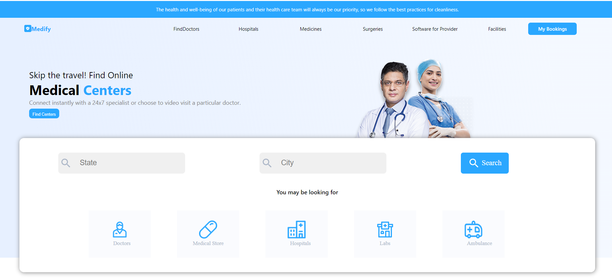

<h1> Medify-Medical Center Slot Booking Platform </h1>

MEDIFY is a web application designed for booking appointment slots at medical centers. Built with modern web technologies, it provides a user-friendly interface for patients to book appointments and for medical centers to manage their schedules efficiently.

 
<h4>Table of Contents</h4>
 
<ul>
<li><a href="#introduction">Introduction</a></li>
<li><a href="features">Features</a></li>
<li><a href="screenshots">Screenshot</a></li>

</ul>

    <h4>Introduction</h4>
    
MEDIFY is a comprehensive platform designed to streamline the process of booking and managing medical appointments. Patients can easily find available slots, book appointments, and receive reminders. Medical centers can manage their schedules, view appointments, and update availability.

    

    <h4>Introduction</h4>
<ul>
<li>User-friendly interface for booking medical appointments</li>
<li>Real-time availability of appointment slots</li>
<li>Responsive design for optimal viewing on various devices</li>
</ul>
    

